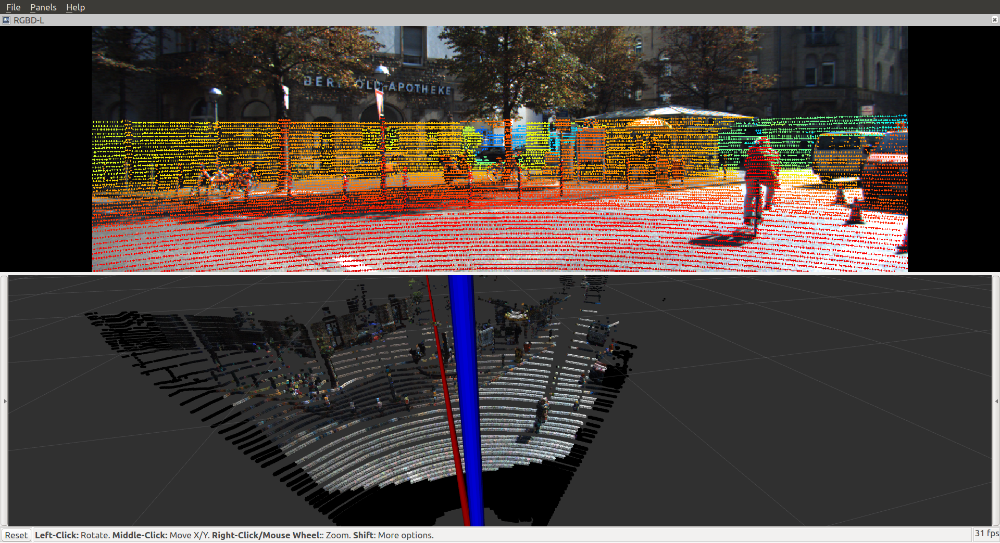

# kitti_lidar_camera
　　KiTTI LiDAR-Camera Fusion, implemented using [kitti_ros](https://github.com/Durant35/kitti_ros).
<p align="center">
    
</p>

## TODO list
- [x] Project Point Cloud into RGB Image, in topic **/kitti/img_depth** _(sensor_msgs/Image)_.
- [x] Color Point Cloud with RGB from Image, in topic **/kitti/points_rgb** _(sensor_msgs/PointCloud2)_.
- [ ] Currently only fusion with the **Left RGB Camera (02)**, which can be selected from any 1 of 4 as a parameter.
- [x] Others the same as [kitti_ros](https://github.com/Durant35/kitti_ros#todo-list).

## How to use
　We name your ros workspace as `CATKIN_WS` and `git clone` [kitti_lidar_camera](https://github.com/Durant35/kitti_lidar_camera) as a ros package.
```sh
# clone source code
$ cd $(CATKIN_WS)/src
$ git clone https://github.com/Durant35/kitti_lidar_camera

# build your ros workspace
$ cd $(CATKIN_WS)
$ catkin build -DCMAKE_BUILD_TYPE=Release

$ source devel/setup.bash
# change Mode for Keyboard Listening Device
$ sudo chmod 777 /dev/input/event3

# [option 1]launch kitti_lidar_camera's kitti_player with rviz
$ roslaunch kitti_lidar_camera demo.launch
# [option 2]launch kitti_lidar_camera's kitti_player without rviz
$ roslaunch kitti_lidar_camera kitti_lidar_camera.launch
```


## [Parameters](./launch/kitti_lidar_camera.launch)
　The same as [kitti_ros](https://github.com/Durant35/kitti_ros#parameters).